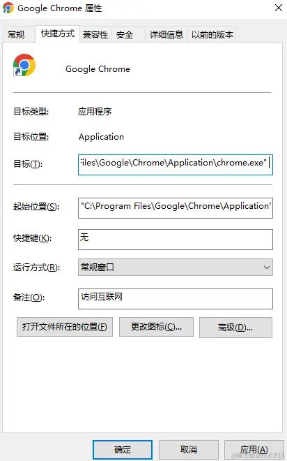

# chrome 一个指令解决跨域

1、右键点击谷歌浏览器，选择属性

2、 在目标输入框尾部加上 --disable-web-security --user-data-dir=C:\MyChromeDevUserData
注意：这里 --disable-web-security 前面有一个空格

3.点击应用和确定后关闭属性页面，并打开 chrome 浏览器。如果浏览器出现提示“你使用的是不受支持的命令标记 --disable-web-security”，那么说明配置成功。
